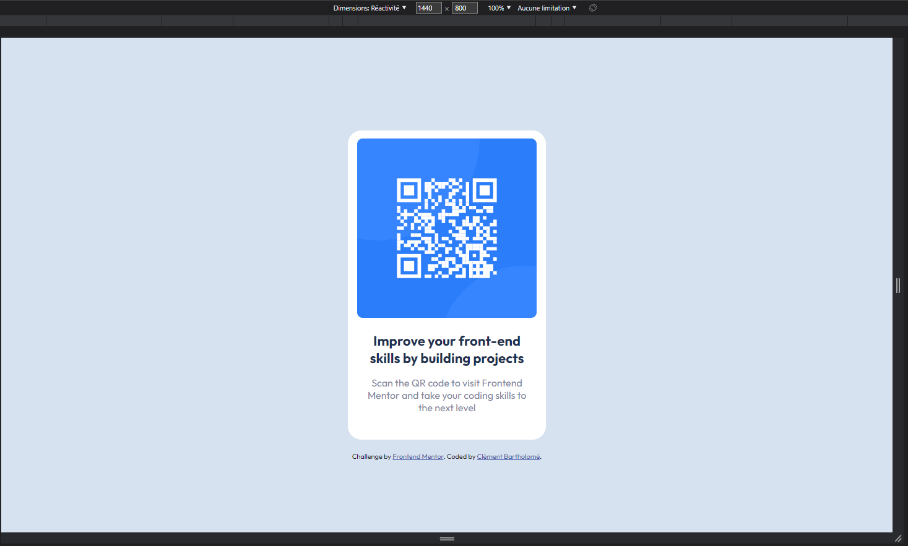
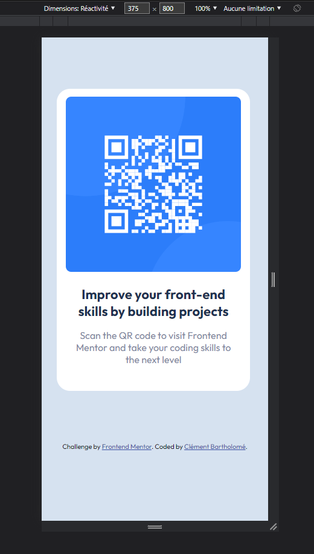

# Frontend Mentor - QR code component solution

This is a solution to the [QR code component challenge on Frontend Mentor](https://www.frontendmentor.io/challenges/qr-code-component-iux_sIO_H). Frontend Mentor challenges help you improve your coding skills by building realistic projects. 

### Screenshot

### Links

- Solution URL: [Add solution URL here](https://your-solution-url.com)
- Live Site URL: [Add live site URL here](https://your-live-site-url.com)

### Built with

- Semantic HTML5 markup
- CSS custom properties
- Mobile-first workflow

### Useful resources

- [freeCodeCamp](https://www.freecodecamp.org/learn/) - Great ressource to learn HTML, CSS, JS and more for free. 
- [Scrimba](https://scrimba.com/dashboard#overview) - Another ressource I recommend to learn coding for free. 

## Author

- Frontend Mentor - [@ClementBartholome](https://www.frontendmentor.io/profile/ClementBartholome)
